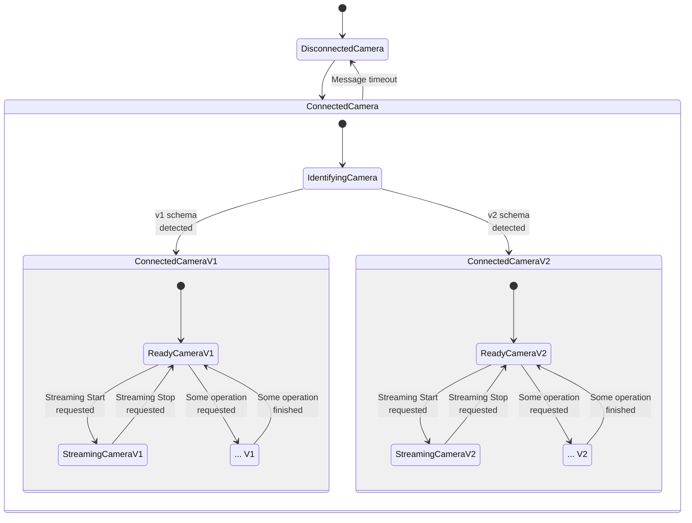

# Design notes for the states-oriented architecture

## Intro

This project bears an implementation of the [TypeState pattern](http://cliffle.com/blog/rust-typestate/) in Python, motivated as [quoted below](https://kobzol.github.io/rust/python/2023/05/20/writing-python-like-its-rust.html) as a way to break a complex `core.camera.state.CameraState` class (no longer part of the code base) and its unwieldy mix-in classes, into a Finite State Machine (FSM) with clear invariants and transition rules.

> Encoding invariants using types
>
> Using the type system itself to encode invariants that would otherwise be only tracked at runtime is a very general and powerful concept. In Python (but also other mainstream languages), I often see classes that are big hairy balls of mutable state.

## High-level overview

The heart of the TypeState pattern is the `State` [Protocol](https://mypy.readthedocs.io/en/stable/protocols.html) in `core.camera.states.base`, which dictates the methods that a class must implement for it to be a valid state in our Camera's FSM.

The `Camera` class in `core.camera.machine` holds the camera's state in its `_state` member, which shall be a specialization of the `StateWithProperties` class (also in `...states.base`), which extends the `State` protocol with an instance of `BaseStateProperties` (also in `...states.base`), that bundles the resources and data attributes required by all state implementations.

It is worth highlighting that `Camera` is the original owner of the `BaseStateProperties` instance, with that instance being handed over from the current state to the next. This follows the TypeState pattern, in which the next state instance is constructed just before transiting into it, passing all required data into its constructor.

Among the important attributes of `BaseStateProperties` is the transition function `transition_fn`. It is `await`ed by the current state to transition to the next state, and it is implemented by `Camera` as one of its methods. This is how the FSM evolves over time in reaction to incoming events, without explicit control being implemented in `Camera`.

Finally, the `Camera` class implements methods that act as the interface to the rest of Local Console (e.g its web API) to enable the user to interact with and control a camera. Such methods may be called at any given moment, when the current state does not match the requested functionality (e.g. starting image streaming, while an OTA update is ongoing). To guard against this, the `only_in_state` method decorator in `core.camera.state_guard` is provided, which serves as lightweight but executable documentation that a method is only expected to be called when the `Camera` is at one of the listed state implementations, otherwise a specific exception is raised.

## Simplifications

The former `core.camera.mixin_mqtt.MQTTMixin` class is stripped to its bare essential on the new class `MQTTDriver` (also in `...states.base`), with the rest of its logic to be implemented by the different specializations of `StateWithProperties`. The `BaseStateProperties` instance holds the instance of `MQTTDriver` associated to the incumbent camera.

The former `core.camera.mixin_streaming.StreamingMixin` class is broken such that the storage size watcher is another one of the resources managed within `BaseStateProperties` of `Camera`, and the remainder of the logic, such as webserver management, RPC issuance and response handling, is moved into specific streaming classes that extend `StateWithProperties`.

## Design for different on-wire schema protocols

As AITRIOS evolves from the v1 on-wire schema to the v2 schema and their different interaction styles (e.g. RPC vs configuration based), there is a need to provide the public methods of `Camera` while accommodating the differences between the two schema implementations. In order to accomplish this goal, the following state sequence is followed:

Such that even though the same transitions are effected to the FSM (via methods in `Camera`), the underlying logic can be arbitrarily different between V1 and V2 state implementations.
